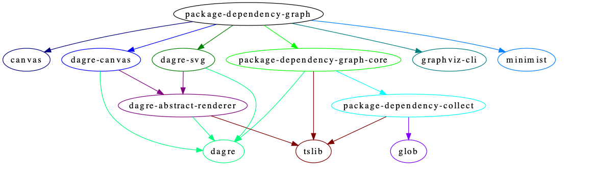
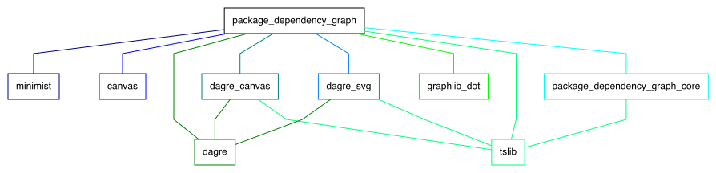

# package-dependency-graph

A CLI tool to generate a dependency graph of packages in a monorepo by graphviz or dagre.

## install

`yarn global add package-dependency-graph`

## usage

### graphviz

1. install `graphviz`
2. run `package-dependency-graph --dot foo.dot`
3. run `dot -Tpng foo.dot > foo.png`

### dagre

`package-dependency-graph --png foo.png`

## arguments

name | type | description
--- | --- | ---
`--root` | string? | tell the CLI the root directory of project
`--dot` | string? | save the dot file
`--png` | string? | save the png file
`--exclude-node_modules` | boolean? | exclude packages from `node_modules`
`--check` | boolean? | check unnecessary dependencies(not recommended)
`--debug` | boolean? | show debug info
